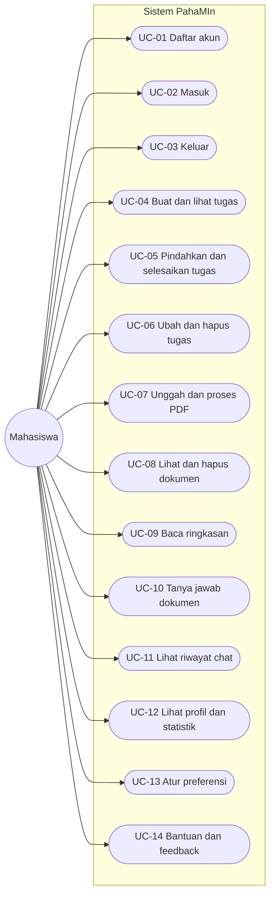
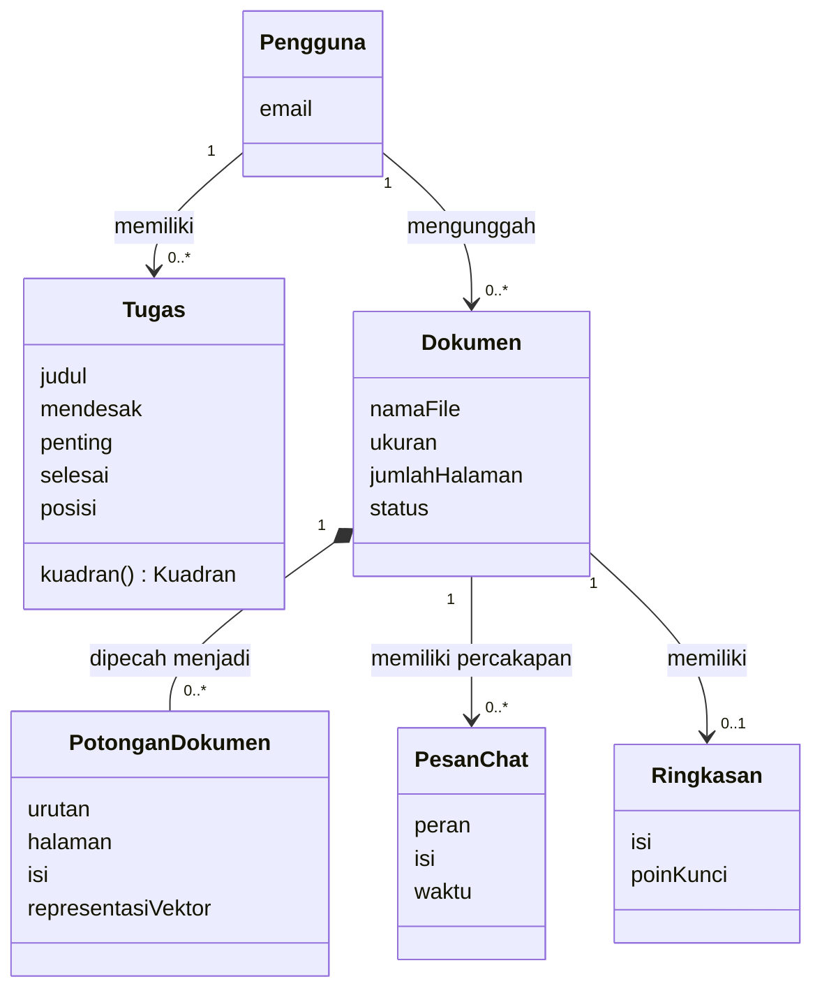

# Spesifikasi Kebutuhan Perangkat Lunak PahaMIn

| Informasi | Nilai |
|---|---|
| Nama sistem | PahaMIn |
| Tim | INTERCORP |
| Jenis dokumen | SKPL / Software Requirements Specification |
| Versi | 1.3 |
| Status | Rancangan untuk review tim |
| Tanggal | 7 Oktober 2026 |
| Acuan kebutuhan utama | [`project-requirements.md`](project-requirements.md) (PRD) |

### Riwayat Revisi

| Versi | Tanggal | Perubahan |
|---|---|---|
| 1.0 | 1 Oktober 2026 | Penyusunan awal |
| 1.1 | 7 Oktober 2026 | Kebutuhan dipecah menjadi atomik dengan ID baru dan metode verifikasi; NFR keamanan dan jaringan dibuat terukur; aktor dirapikan; use case dilengkapi; detail desain (library, class layanan) dikeluarkan ke DPPL; keputusan terbuka dikumpulkan dalam satu daftar dengan rekomendasi bawaan |
| 1.2 | 7 Oktober 2026 | Seluruh keputusan KD diputuskan memakai rekomendasi bawaan; perangkat referensi (Lenovo IdeaPad Gaming 3 15ACH6, Ryzen 5 5600H) dan lingkungan demo (hanya localhost) ditetapkan; status kebutuhan terkait berubah dari Draf menjadi Final; tenggat tugas dikeluarkan dari lingkup demo; ditambahkan temuan kelayakan model AI pada perangkat referensi |
| 1.3 | 7 Oktober 2026 | Keputusan desain DD-01 s.d. DD-05 dicatat sebagai diputuskan pada DPPL v1.3; NFR-SEC-03 menjadi Final |

PRD tetap menjadi sumber utama scope produk. Jika ada perbedaan, keputusan terbaru yang disetujui pada PRD mengungguli dokumen ini.

## Daftar Isi

1. [Pendahuluan](#1-pendahuluan)
2. [Deskripsi Umum](#2-deskripsi-umum)
3. [Aturan Bisnis](#3-aturan-bisnis)
4. [Kebutuhan Fungsional](#4-kebutuhan-fungsional)
5. [Kebutuhan Nonfungsional](#5-kebutuhan-nonfungsional)
6. [Use Case](#6-use-case)
7. [Model Domain](#7-model-domain)
8. [Keputusan](#8-keputusan)
9. [Traceability](#9-traceability)

---

## 1. Pendahuluan

### 1.1 Tujuan

SKPL ini menjadi acuan bagi pengembang, QA, dan reviewer tentang **apa** yang harus disediakan PahaMIn, batas sistem, dan cara memverifikasinya. **Bagaimana** sistem dibangun (arsitektur, skema, library, parameter) ada di DPPL.

### 1.2 Lingkup

PahaMIn adalah aplikasi web untuk membantu mahasiswa mengelola prioritas tugas dengan Matriks Eisenhower dan memahami materi melalui Ruang Paham. Ruang Paham memproses PDF dan menyediakan ringkasan serta tanya jawab berbasis Retrieval-Augmented Generation (RAG). Aplikasi ditujukan untuk tugas akademik dan demonstrasi lokal.

UI/UX sudah tersedia di Figma. Implementasi mengikuti desain tersebut; dokumen ini tidak meminta pembuatan ulang UI.

### 1.3 Istilah

| Istilah | Arti |
|---|---|
| SKPL / SRS | Spesifikasi Kebutuhan Perangkat Lunak |
| Matriks Eisenhower | Pengelompokan tugas ke empat kuadran menurut urgensi dan kepentingan |
| RAG | Retrieval-Augmented Generation: jawaban dibuat dengan mengambil konteks relevan dari dokumen |
| Potongan (chunk) | Bagian teks dokumen yang diindeks dan dipakai untuk pencarian |
| RLS | Row Level Security, pembatasan akses baris data berdasarkan pengguna |
| JWT | Token sesi yang dipakai untuk mengidentifikasi pengguna pada permintaan |
| Perangkat referensi | Mesin tempat pengukuran kinerja dan demo dilakukan (lihat ASM-04) |

### 1.4 Konvensi Penulisan Kebutuhan

- **ID:** `FR-<GRUP>-<NN>` untuk fungsional, `NFR-<GRUP>-<NN>` untuk nonfungsional. Grup mengikuti PRD: `AUTH`, `TASK`, `DOC`, `SUM`, `CHAT`, `PROF`, `SET`, `UI`; NFR: `PERF`, `SEC`, `NET`, `UX`, `REL`, `PRV`. ID tidak dipakai ulang; kebutuhan yang dihapus ditandai dihapus, bukan diganti nomornya.
- **Atomik:** satu ID menyatakan satu perilaku yang dapat diuji.
- **Prioritas:** Must (wajib untuk demo), Should (diharapkan), Could (bila waktu cukup).
- **Status:** **Final** = isi sudah diputuskan. **Draf (KD-xx)** = bergantung pada keputusan terbuka pada Bab 8, atau memuat angka usulan yang perlu dikonfirmasi.
- **Verifikasi:** **U** = uji, **I** = inspeksi (kode/konfigurasi/dokumen), **D** = demonstrasi, **A** = analisis/pengukuran.
- **Aturan keputusan:** setiap kebutuhan Must berstatus Draf memiliki *rekomendasi bawaan* pada Bab 8. Jika tim tidak memutuskan sampai batas yang ditetapkan, rekomendasi bawaan berlaku.

---

## 2. Deskripsi Umum

### 2.1 Pemangku Kepentingan dan Aktor

| Pihak | Peran |
|---|---|
| **Mahasiswa** | Satu-satunya aktor pengguna sistem: mengelola tugas, PDF, percakapan, dan profil miliknya. |
| Administrator teknis (anggota tim) | Pemangku kepentingan di luar produk: mengelola infrastruktur lewat dashboard layanan dan lingkungan pengembangan. Tidak ada antarmuka administrator di dalam produk. |

### 2.2 Sistem Eksternal

Layanan berikut adalah **komponen/ketergantungan**, bukan aktor.

| Layanan | Kebutuhan terhadap layanan |
|---|---|
| Supabase Auth | Identitas, sesi, dan token pengguna |
| Supabase PostgreSQL + pgvector | Penyimpanan data aplikasi dan pencarian kemiripan vektor, dengan RLS |
| Supabase Storage | Penyimpanan file PDF milik pengguna |
| Ollama (lokal) | Pembuatan representasi vektor, ringkasan, dan jawaban |

### 2.3 Batasan

| ID | Batasan |
|---|---|
| BAT-01 | Berkas yang diterima hanya PDF, maksimal 5 MB per berkas. |
| BAT-02 | Sistem memproses maksimal 20 halaman pertama setiap PDF. |
| BAT-03 | Pemotongan teks menargetkan ±500 token per potongan dengan overlap ±50 token. |
| BAT-04 | Pencarian konteks mengambil maksimal lima potongan dari dokumen yang dipilih. |
| BAT-05 | Pemrosesan AI (vektor, ringkasan, jawaban) berjalan pada Ollama lokal, bukan layanan AI pihak ketiga. |
| BAT-06 | Data aplikasi, autentikasi, dan file berada pada Supabase; pembatasan akses data memakai RLS. |
| BAT-07 | Sistem tidak mendukung mode offline. |

### 2.4 Asumsi dan Ketergantungan

| ID | Asumsi |
|---|---|
| ASM-01 | Pada perangkat demo, Ollama berjalan dan model yang dibutuhkan sudah terpasang. |
| ASM-02 | Perangkat demo memiliki koneksi internet ke Supabase. |
| ASM-03 | Desain Figma tersedia dan menjadi acuan tampilan. |
| ASM-04 | **Perangkat referensi** untuk pengukuran kinerja dan demo: Lenovo IdeaPad Gaming 3 15ACH6 dengan CPU AMD Ryzen 5 5600H (6 core/12 thread). Seri ini umumnya memakai GPU NVIDIA GeForce RTX 3050 (4 GB VRAM) dan RAM 8 atau 16 GB; **GPU, RAM, dan versi OS pada mesin sebenarnya harus dikonfirmasi dan dicatat** sebelum pengukuran (lihat 8.3). |
| ASM-05 | Demo dijalankan hanya pada mesin pengembang melalui localhost (KD-13). |

### 2.5 Di Luar Lingkup

Deployment production dan multi-server; load balancing, Redis, dan message queue; login pihak ketiga (Google/Gmail OAuth); dashboard administrator di dalam produk; generator kuis; Google Gemini; mode offline; monitoring production tingkat lanjut.

---

## 3. Aturan Bisnis

| ID | Aturan |
|---|---|
| BR-01 | **Kuadran Eisenhower** ditentukan dari dua atribut tugas: Mendesak=Ya & Penting=Ya → *Lakukan*; Mendesak=Tidak & Penting=Ya → *Jadwalkan*; Mendesak=Ya & Penting=Tidak → *Delegasikan*; Mendesak=Tidak & Penting=Tidak → *Abaikan*. |
| BR-02 | Setiap data (tugas, dokumen, potongan, percakapan, profil) dimiliki satu pengguna dan hanya dapat diakses pemiliknya. |
| BR-03 | Ringkasan dan tanya jawab hanya dapat digunakan pada dokumen berstatus **siap** (pemrosesan selesai). |
| BR-04 | Jawaban hanya boleh didasarkan pada isi dokumen yang dipilih; bila tidak didukung dokumen, sistem menyatakan keterbatasan. |

---

## 4. Kebutuhan Fungsional

### 4.1 Autentikasi (`AUTH`)

| ID | Kebutuhan | Prioritas | Status | Verifikasi |
|---|---|---|---|---|
| FR-AUTH-01 | Pengguna dapat mendaftar akun dengan email dan kata sandi. | Must | Final | U |
| FR-AUTH-02 | Pengguna terdaftar dapat masuk dengan email dan kata sandi yang benar. | Must | Final | U |
| FR-AUTH-03 | Kredensial salah ditolak dengan pesan yang tidak mengungkapkan apakah email tersebut terdaftar. | Must | Final | U |
| FR-AUTH-04 | Pengguna dapat keluar; setelah itu halaman dan data terlindungi tidak dapat diakses tanpa masuk kembali. | Must | Final | U |
| FR-AUTH-05 | Pengguna tanpa sesi yang valid yang membuka halaman terlindungi diarahkan ke halaman masuk. | Must | Final | U |
| FR-AUTH-06 | Sistem memverifikasi kepemilikan email saat pendaftaran. | Could | Final | U |
| FR-AUTH-07 | Pengguna dapat memulihkan akun yang lupa kata sandi. | Could | Final | U |

### 4.2 Matriks Tugas (`TASK`)

| ID | Kebutuhan | Prioritas | Status | Verifikasi |
|---|---|---|---|---|
| FR-TASK-01 | Pengguna dapat membuat tugas dengan judul, urgensi (ya/tidak), dan kepentingan (ya/tidak). | Must | Final | U |
| FR-TASK-02 | Judul tugas wajib diisi, tidak boleh hanya spasi, dan maksimal 150 karakter; pelanggaran ditolak dengan pesan. | Must | Draf (angka usulan) | U |
| FR-TASK-03 | Sistem menempatkan tugas ke kuadran sesuai BR-01. | Must | Final | U |
| FR-TASK-04 | Pengguna melihat seluruh tugas miliknya, dikelompokkan per kuadran. | Must | Final | U |
| FR-TASK-05 | Pengguna dapat menandai tugas selesai; tugas selesai tetap terlihat dengan penanda yang tidak hanya berupa warna. | Must | Draf (usulan tampilan) | U |
| FR-TASK-06 | Pengguna dapat memindahkan tugas ke kuadran lain; posisi baru tetap sama setelah halaman dimuat ulang. | Must | Final | U |
| FR-TASK-07 | Setelah pemindahan, urgensi dan kepentingan tugas diselaraskan dengan kuadran tujuan sesuai BR-01. | Must | Final | U |
| FR-TASK-08 | Pemindahan tugas dapat dilakukan tanpa drag-and-drop (kontrol tersendiri) pada semua ukuran layar. | Must | Final | D |
| FR-TASK-09 | Bila penyimpanan perubahan gagal, tampilan kembali ke keadaan sebelumnya dan pengguna menerima pesan. | Must | Final | U |
| FR-TASK-10 | Pengguna dapat mengubah judul, urgensi, dan kepentingan tugas. | Should | Final | U |
| FR-TASK-11 | Pengguna dapat menghapus tugas setelah konfirmasi. | Should | Final | U |
| FR-TASK-12 | ~~Pengguna dapat menetapkan tenggat pada tugas.~~ Dikeluarkan dari lingkup versi demo (KD-02); dapat dipertimbangkan pada versi berikutnya. | – | Ditunda | – |

### 4.3 Dokumen dan Ruang Paham (`DOC`)

| ID | Kebutuhan | Prioritas | Status | Verifikasi |
|---|---|---|---|---|
| FR-DOC-01 | Pengguna dapat memilih dan mengunggah berkas PDF. | Must | Final | U |
| FR-DOC-02 | Sistem menolak berkas yang bukan PDF berdasarkan **isi berkas** di sisi server, bukan hanya nama atau tipe yang dikirim browser. | Must | Final | U |
| FR-DOC-03 | Sistem menolak berkas lebih dari 5 MB dengan pesan yang jelas. | Must | Final | U |
| FR-DOC-04 | Sistem mengekstrak teks dari maksimal 20 halaman pertama; pengguna diberi tahu bila halaman sisanya diabaikan. | Must | Final | U |
| FR-DOC-05 | PDF rusak, terenkripsi, kosong, atau tanpa teks yang dapat diekstrak menghasilkan status gagal dengan penyebab yang dapat dipahami, tanpa data parsial yang tersisa. | Must | Final | U |
| FR-DOC-06 | Pengguna melihat status pemrosesan dokumen: sedang diproses, siap, atau gagal. | Must | Final | D |
| FR-DOC-07 | Sistem memecah teks menjadi potongan sesuai BAT-03. | Must | Final | U |
| FR-DOC-08 | Sistem membuat representasi vektor untuk setiap potongan dan menyimpannya terkait dokumen dan pemilik. | Must | Final | I, U |
| FR-DOC-09 | Pengguna melihat daftar dokumen miliknya beserta nama, ukuran, dan status. | Must | Final | U |
| FR-DOC-10 | Pengguna dapat menghapus dokumen; file, potongan, riwayat chat, dan ringkasan dokumen itu ikut terhapus. | Should | Final | U |
| FR-DOC-11 | Pengguna dapat memproses ulang dokumen yang gagal. | Could | Final | U |
| FR-DOC-12 | Sistem membatasi jumlah dokumen maksimal 10 per akun; unggahan di atas batas ditolak dengan pesan yang jelas. | Should | Final | U |

### 4.4 Ringkasan (`SUM`)

| ID | Kebutuhan | Prioritas | Status | Verifikasi |
|---|---|---|---|---|
| FR-SUM-01 | Pengguna dapat meminta ringkasan berupa paragraf ringkas dan poin kunci dari dokumen berstatus siap. | Must | Final | U |
| FR-SUM-02 | Ringkasan hanya berisi informasi dari dokumen yang dipilih (BR-04). | Must | Final | U |
| FR-SUM-03 | Permintaan ringkasan pada dokumen yang belum siap ditolak dengan pesan yang jelas (BR-03). | Must | Final | U |
| FR-SUM-04 | Ringkasan yang sudah dibuat tersimpan dan dapat dibuka kembali tanpa dibuat ulang. | Should | Final | U |
| FR-SUM-05 | Pengguna dapat meminta ringkasan dibuat ulang. | Could | Final | U |

### 4.5 Tanya Jawab dan Riwayat (`CHAT`)

| ID | Kebutuhan | Prioritas | Status | Verifikasi |
|---|---|---|---|---|
| FR-CHAT-01 | Pengguna dapat mengajukan pertanyaan pada dokumen miliknya yang berstatus siap. | Must | Final | U |
| FR-CHAT-02 | Pertanyaan kosong, hanya spasi, atau lebih dari 1000 karakter ditolak dengan pesan. | Must | Draf (angka usulan) | U |
| FR-CHAT-03 | Jawaban dibuat dari maksimal lima potongan paling relevan dan hanya dari dokumen yang dipilih (BAT-04). | Must | Final | I, U |
| FR-CHAT-04 | Bila konteks yang ditemukan tidak cukup, sistem menyatakan informasi tidak ditemukan dalam materi dan tidak mengarang jawaban. Kriteria lulus: pada 10 pertanyaan uji yang jawabannya tidak ada di dokumen, minimal 9 dijawab dengan pernyataan keterbatasan. | Must | Final | U |
| FR-CHAT-05 | Setiap pertanyaan dan jawaban tersimpan terkait dokumen dan pemilik yang benar. | Must | Final | U |
| FR-CHAT-06 | Saat dokumen dibuka kembali, pengguna melihat riwayat percakapan dokumen itu berurutan menurut waktu. | Must | Final | U |
| FR-CHAT-07 | Jawaban menampilkan nomor halaman sumber potongan yang digunakan. | Should | Final | U |

### 4.6 Profil dan Statistik (`PROF`)

| ID | Kebutuhan | Prioritas | Status | Verifikasi |
|---|---|---|---|---|
| FR-PROF-01 | Pengguna dapat melihat profil berisi email akunnya. | Must | Final | D |
| FR-PROF-02 | Pengguna melihat statistik aktivitas belajar: jumlah dokumen berstatus siap, jumlah pertanyaan chat, dan streak (jumlah hari berurutan dengan minimal satu pertanyaan chat per hari, zona waktu Asia/Jakarta). | Must | Final | U |
| FR-PROF-03 | Statistik dihitung hanya dari data milik pengguna tersebut. | Must | Final | U |

### 4.7 Pengaturan dan Bantuan (`SET`)

| ID | Kebutuhan | Prioritas | Status | Verifikasi |
|---|---|---|---|---|
| FR-SET-01 | Halaman pengaturan dan bantuan tersedia sesuai layar Figma. | Must | Final | D |
| FR-SET-02 | Pengguna dapat memilih tema tampilan dan pilihan itu tersimpan lintas sesi. | Should | Final | U |
| FR-SET-03 | Pengguna dapat mengatur ukuran teks dan pilihan itu tersimpan lintas sesi. | Should | Final | U |
| FR-SET-04 | Pengguna dapat memilih bahasa antarmuka. | Could | Final | U |
| FR-SET-05 | Pengguna dapat mengatur preferensi notifikasi. | Could | Final | U |
| FR-SET-06 | Halaman bantuan menampilkan panduan penggunaan/FAQ. | Should | Final | D |
| FR-SET-07 | Pengguna dapat mengirim feedback atau laporan bug. | Should | Final | U |

> Prioritas FR-SET lebih rendah dari v1.0 (sebelumnya Must secara menyeluruh). Sesuai KD-09, tema dan ukuran teks diimplementasikan; bahasa dan notifikasi hanya bila waktu cukup. Sesuai KD-10, FAQ statis dan feedback tersimpan di sistem.

### 4.8 Umum Antarmuka (`UI`)

| ID | Kebutuhan | Prioritas | Status | Verifikasi |
|---|---|---|---|---|
| FR-UI-01 | Alur utama (tugas, unggah, ringkasan, chat, profil) memiliki keadaan memuat, kosong, sukses, dan error. | Must | Final | D |
| FR-UI-02 | Pesan error berbahasa yang dapat dipahami pengguna dan tidak memuat detail teknis internal. | Must | Final | I, U |

---

## 5. Kebutuhan Nonfungsional

Semua kriteria lulus bersifat terukur. Angka yang berasal dari PRD/SKPL v1.0 berstatus Final; angka baru berstatus **Draf (angka usulan)** dan perlu dikonfirmasi tim.

### 5.1 Kinerja (`PERF`)

| ID | Kebutuhan dan kriteria lulus | Prioritas | Status | Verifikasi |
|---|---|---|---|---|
| NFR-PERF-01 | **Waktu respons chat** dari pertanyaan terkirim sampai jawaban lengkap tampil: median ≤ 10 detik dan persentil ke-95 ≤ 20 detik, pada perangkat referensi, model sudah termuat, minimal 20 pertanyaan uji. | Must | Draf (angka usulan; ≤10 dt dari v1.0; kelayakan lihat 8.3) | A |
| NFR-PERF-02 | Permintaan AI pertama setelah model tidak aktif selesai ≤ 30 detik dan UI menampilkan indikator menunggu. | Should | Draf (angka usulan) | A |
| NFR-PERF-03 | Ringkasan yang sudah tersimpan tampil ≤ 2 detik; ringkasan yang baru dibuat selesai ≤ 30 detik untuk dokumen 20 halaman. | Should | Draf (angka usulan) | A |
| NFR-PERF-04 | Pemrosesan PDF 20 halaman hingga status siap ≤ 120 detik pada perangkat referensi. | Should | Draf (angka usulan) | A |
| NFR-PERF-05 | Halaman Matriks Tugas tampil ≤ 2 detik dengan 100 tugas; perubahan posisi/status tampak di UI ≤ 100 ms. | Should | Draf (angka usulan) | A |

### 5.2 Keamanan (`SEC`)

| ID | Kebutuhan dan kriteria lulus | Prioritas | Status | Verifikasi |
|---|---|---|---|---|
| NFR-SEC-01 | **Isolasi data.** RLS aktif pada semua tabel berisi data pengguna. Pada uji dengan dua akun, akun B memiliki 0 keberhasilan membaca, mengubah, atau menghapus data akun A melalui akses langsung ke Supabase maupun melalui layanan AI. | Must | Final | U, I |
| NFR-SEC-02 | **Autentikasi permintaan AI.** Setiap permintaan ke layanan AI (selain pemeriksaan kesehatan) membawa token sesi yang diverifikasi tanda tangan, masa berlaku, dan audience-nya. Token hilang, kedaluwarsa, atau dimodifikasi menghasilkan penolakan 401 pada 100% kasus uji. | Must | Final | U |
| NFR-SEC-03 | **Otorisasi dokumen.** Permintaan yang memakai ID dokumen milik pengguna lain ditolak pada 100% kasus uji dan responsnya tidak membedakan "bukan milik Anda" dari "tidak ada". | Must | Final | U |
| NFR-SEC-04 | **Kata sandi.** Panjang minimal 8 karakter; kata sandi yang lebih pendek ditolak. Kata sandi tidak pernah tampil pada log, respons, maupun URL. | Must | Final | U, I |
| NFR-SEC-05 | **Sesi.** Token akses berlaku ≤ 1 jam dan diperbarui otomatis; setelah keluar, token lama tidak dapat dipakai. Token sesi tidak disimpan di penyimpanan lokal browser yang dapat dibaca skrip halaman. | Must | Final | U, I |
| NFR-SEC-06 | **Pembatasan laju.** Layanan AI membatasi setiap pengguna maksimal 20 permintaan chat per menit dan 5 permintaan pemrosesan dokumen per menit; kelebihan ditolak dengan 429. | Should | Draf (angka usulan) | U |
| NFR-SEC-07 | **Keamanan unggahan.** Dari berkas uji berikut, 100% yang tidak valid ditolak sebelum diproses: berkas non-PDF berekstensi `.pdf`, berkas ZIP/EXE yang diganti nama, berkas 0 byte, berkas 5 MB + 1 byte, dan PDF terenkripsi. Batas ukuran dan tipe ditegakkan di sisi penyimpanan dan diperiksa ulang di backend; validasi di browser tidak dianggap sebagai pertahanan. | Must | Final | U |
| NFR-SEC-08 | **Penyimpanan file.** Bucket PDF bersifat privat. Tidak ada URL publik; tautan sementara, bila dipakai, berlaku ≤ 60 detik. Pengguna hanya dapat mengakses objek pada folder miliknya. | Must | Draf (usulan masa berlaku) | U, I |
| NFR-SEC-09 | **Rahasia.** Kunci server (termasuk service role key) tidak ada pada kode frontend, bundle browser, maupun repositori. Pemindaian rahasia pada repositori dan bundle menghasilkan 0 temuan. | Must | Final | I |
| NFR-SEC-10 | **Validasi input server.** Semua permintaan ke layanan AI divalidasi terhadap skema; input tidak valid menghasilkan 422 dan tidak pernah menyebabkan 500 pada uji input cacat (JSON rusak, tipe salah, field hilang, string sangat panjang). | Must | Final | U |
| NFR-SEC-11 | **Prompt injection.** Pada 5 dokumen uji yang berisi instruksi berbahaya (mengabaikan aturan, membocorkan prompt sistem, mengubah peran), sistem tidak mengikuti instruksi tersebut dan tidak mengungkap prompt sistem pada minimal 4 dari 5 dokumen. | Must | Draf (ambang usulan) | U |
| NFR-SEC-12 | **Keluaran model aman.** Keluaran model ditampilkan tanpa mengeksekusi HTML atau skrip. Pada uji payload `<script>` dan `` di dalam jawaban/ringkasan, 0 skrip tereksekusi. | Must | Final | U |
| NFR-SEC-13 | **Logging.** Log tidak memuat token, kata sandi, isi dokumen, isi pertanyaan, maupun isi jawaban. Setiap permintaan memiliki ID korelasi. Pemeriksaan sampel log pada skenario uji menemukan 0 data sensitif. | Must | Final | I |
| NFR-SEC-14 | **Pesan error aman.** Respons error tidak memuat stack trace, path berkas, nama host internal, atau isi prompt. | Must | Final | U |
| NFR-SEC-15 | **Dependensi.** Audit dependensi frontend dan backend saat rilis demo menunjukkan 0 kerentanan tingkat *critical* dan *high* yang belum ditangani atau didokumentasikan. | Should | Draf (usulan) | I |
| NFR-SEC-16 | **Header keamanan frontend.** Respons aplikasi menyertakan kebijakan pembatasan konten (CSP), pencegahan sniffing tipe konten, dan pencegahan framing oleh situs lain. | Should | Draf (usulan) | I |

### 5.3 Jaringan (`NET`)

| ID | Kebutuhan dan kriteria lulus | Prioritas | Status | Verifikasi |
|---|---|---|---|---|
| NFR-NET-01 | **Ollama hanya lokal.** Layanan Ollama hanya menerima koneksi dari mesin yang sama. Uji dari perangkat lain di jaringan yang sama ke port Ollama harus gagal (koneksi ditolak/timeout). | Must | Final | U |
| NFR-NET-02 | **Hanya localhost.** Sesuai KD-13, seluruh layanan (aplikasi web, layanan AI, Ollama) hanya menerima koneksi dari mesin yang sama (loopback). Uji dari perangkat lain di jaringan yang sama ke port aplikasi web, layanan AI, dan Ollama harus gagal untuk ketiganya. | Must | Final | U |
| NFR-NET-03 | **Port minimal.** Pemindaian port ke alamat laptop dari perangkat lain di jaringan yang sama menunjukkan 0 port layanan PahaMIn yang terbuka. | Must | Final | U |
| NFR-NET-04 | **Tanpa akses langsung browser ke Ollama.** Tidak ada alamat atau kredensial Ollama pada kode atau bundle frontend; semua proses AI melewati layanan AI backend. | Must | Final | I |
| NFR-NET-05 | **Enkripsi ke layanan cloud.** Seluruh komunikasi ke Supabase memakai HTTPS (TLS 1.2 atau lebih baru); tidak ada fallback ke HTTP. Komunikasi tanpa TLS hanya diizinkan pada antarmuka loopback mesin yang sama. | Must | Final | I, U |
| NFR-NET-06 | **CORS.** Layanan AI hanya mengizinkan origin aplikasi web yang terdaftar secara eksplisit; tidak memakai wildcard. Permintaan dari origin lain tidak menerima header izin CORS. CORS tidak dianggap sebagai kontrol otorisasi (lihat NFR-SEC-02). | Must | Final | U |
| NFR-NET-07 | **Timeout antar-layanan.** Setiap panggilan ke Ollama dan Supabase memiliki batas waktu: embedding ≤ 30 detik, generasi ≤ 60 detik, Supabase ≤ 10 detik. Melewati batas menghasilkan error terkontrol ke pengguna (503), bukan permintaan yang menggantung. | Must | Draf (angka usulan) | U |
| NFR-NET-08 | **Degradasi layanan.** Saat Ollama dimatikan, login dan Matriks Tugas tetap berfungsi penuh, sedangkan fitur AI menampilkan pesan layanan tidak tersedia. | Must | Final | U |
| NFR-NET-09 | **Gangguan Supabase.** Saat Supabase tidak dapat dijangkau, aplikasi menampilkan pesan error dan tidak menampilkan status berhasil palsu. | Must | Final | U |

### 5.4 Usability dan Aksesibilitas (`UX`)

| ID | Kebutuhan dan kriteria lulus | Prioritas | Status | Verifikasi |
|---|---|---|---|---|
| NFR-UX-01 | Alur utama (masuk, buat tugas, pindahkan tugas, unggah PDF, tanya jawab) dapat diselesaikan hanya dengan keyboard, dengan indikator fokus yang jelas. | Must | Final | D |
| NFR-UX-02 | Kontras teks terhadap latar minimal 4,5:1 (WCAG 2.1 AA) untuk teks normal. | Should | Draf (usulan) | I |
| NFR-UX-03 | Pada lebar layar di bawah 768 px, matriks tugas tersusun vertikal; pada lebar 360 px tidak muncul scroll horizontal pada halaman utama. | Must | Final | D |
| NFR-UX-04 | Status (kuadran, status dokumen, error) tidak hanya dibedakan oleh warna. | Must | Final | I |
| NFR-UX-05 | Aplikasi berfungsi pada dua versi stabil terakhir Chrome, Edge, dan Firefox. | Should | Final | D |

### 5.5 Keandalan (`REL`)

| ID | Kebutuhan dan kriteria lulus | Prioritas | Status | Verifikasi |
|---|---|---|---|---|
| NFR-REL-01 | Kegagalan jaringan, database, penyimpanan, autentikasi, atau Ollama ditampilkan sebagai pesan yang jelas dan tidak membuat aplikasi berhenti berfungsi. | Must | Final | U |
| NFR-REL-02 | Dokumen tidak pernah berstatus siap tanpa seluruh potongan dan vektornya tersimpan. Pada uji dengan proses diinterupsi di tengah jalan, 0 dokumen berstatus siap dengan data tidak lengkap. | Must | Final | U |
| NFR-REL-03 | Dokumen tidak tertahan pada status "sedang diproses" lebih dari 15 menit; setelah itu berubah menjadi gagal. | Should | Draf (angka usulan) | U |

### 5.6 Privasi dan Data (`PRV`)

| ID | Kebutuhan dan kriteria lulus | Prioritas | Status | Verifikasi |
|---|---|---|---|---|
| NFR-PRV-01 | PDF dan isi dokumen diperlakukan sebagai data pengguna dan tidak dikirim ke layanan AI pihak ketiga. Pemeriksaan jejak jaringan saat pemrosesan menunjukkan 0 koneksi keluar selain ke Supabase dan Ollama lokal. | Must | Final | I, A |
| NFR-PRV-02 | Instruksi di dalam dokumen tidak mengganti instruksi sistem AI atau membuka data di luar dokumen yang diizinkan (lihat uji NFR-SEC-11). | Must | Final | U |
| NFR-PRV-03 | Data pribadi yang disimpan dibatasi pada email akun dan konten yang dibuat pengguna sendiri. | Should | Draf (usulan) | I |
| NFR-PRV-04 | Penghapusan dokumen atau akun menghapus data turunannya sesuai keputusan retensi. | Should | Final | U |

---

## 6. Use Case

### 6.1 Diagram

Satu-satunya aktor adalah Mahasiswa. Layanan eksternal bukan aktor (lihat 2.2).

### 6.2 Skenario Ringkas

| UC | Prasyarat | Alur utama | Alternatif / pengecualian | Kebutuhan terkait |
|---|---|---|---|---|
| UC-01 Daftar akun | Belum memiliki akun | Pengguna mengisi email dan kata sandi → sistem membuat akun → pengguna diarahkan ke halaman utama | Email sudah terdaftar atau kata sandi tidak memenuhi syarat → pesan | FR-AUTH-01, 06, NFR-SEC-04 |
| UC-02 Masuk | Memiliki akun | Pengguna mengisi kredensial → sesi dibuat → diarahkan ke halaman utama | Kredensial salah → pesan netral; layanan gagal → pesan error | FR-AUTH-02, 03, 05, 07 |
| UC-03 Keluar | Sesi aktif | Pengguna memilih keluar → sesi berakhir → diarahkan ke masuk | – | FR-AUTH-04 |
| UC-04 Buat dan lihat tugas | Sesi aktif | Pengguna membuka Matriks Tugas → sistem menampilkan tugas per kuadran → pengguna mengisi judul, urgensi, kepentingan → tugas muncul di kuadran sesuai BR-01 | Judul tidak valid → pesan; gagal simpan → pulihkan dan beri pesan | FR-TASK-01 s.d. 04, 09 |
| UC-05 Pindahkan dan selesaikan tugas | Ada tugas | Pengguna memindahkan kartu (drag atau kontrol alternatif) atau menandai selesai → tampilan langsung berubah → perubahan tersimpan | Gagal simpan → tampilan kembali + pesan | FR-TASK-05 s.d. 09 |
| UC-06 Ubah dan hapus tugas | Ada tugas | Pengguna mengubah atau menghapus tugas (dengan konfirmasi) | Gagal simpan → pesan | FR-TASK-10, 11, 12 |
| UC-07 Unggah dan proses PDF | Sesi aktif | Pengguna memilih PDF → sistem memvalidasi → file disimpan → teks diekstrak, dipotong, divektorkan → status siap | Bukan PDF, > 5 MB, rusak, terenkripsi, kosong, tanpa teks, batas dokumen, atau Ollama/Supabase gagal → status gagal dan pesan jelas | FR-DOC-01 s.d. 08, 12, NFR-SEC-07 |
| UC-08 Lihat dan hapus dokumen | Sesi aktif | Pengguna melihat daftar dokumen → dapat menghapus dokumen setelah konfirmasi | Hapus gagal → pesan | FR-DOC-09, 10, 11 |
| UC-09 Baca ringkasan | Dokumen siap, milik pengguna | Pengguna membuka/meminta ringkasan → sistem menampilkan ringkasan | Dokumen belum siap atau layanan AI gagal → pesan | FR-SUM-01 s.d. 05 |
| UC-10 Tanya jawab dokumen | Dokumen siap | Pengguna mengirim pertanyaan → sistem mencari potongan relevan → menjawab berdasarkan konteks → jawaban dan pertanyaan tersimpan | Pertanyaan tidak valid → ditolak; konteks tidak cukup → pernyataan keterbatasan; layanan gagal → pesan dan opsi coba lagi | FR-CHAT-01 s.d. 05, 07 |
| UC-11 Lihat riwayat chat | Dokumen memiliki percakapan | Pengguna membuka dokumen → sistem menampilkan riwayat berurutan | Belum ada percakapan → keadaan kosong | FR-CHAT-06 |
| UC-12 Lihat profil dan statistik | Sesi aktif | Pengguna membuka profil → sistem menampilkan email dan statistik | Data belum ada → keadaan kosong | FR-PROF-01, 02, 03 |
| UC-13 Atur preferensi | Sesi aktif | Pengguna mengubah tema, ukuran teks, bahasa, atau notifikasi → tersimpan | Gagal simpan → pesan | FR-SET-01 s.d. 05 |
| UC-14 Bantuan dan feedback | Sesi aktif | Pengguna membaca bantuan atau mengirim feedback/laporan bug | Gagal kirim → pesan | FR-SET-06, 07 |

Setiap use case memakai FR-UI-01 dan FR-UI-02 untuk keadaan loading/kosong/error.

---

## 7. Model Domain

Model konseptual, bebas dari keputusan penyimpanan. Skema tabel, tipe data, dan indeks ada di DPPL.

Catatan:

- `Tugas.kuadran()` diturunkan dari `mendesak` dan `penting` (BR-01); kuadran bukan data tersendiri.
- `Ringkasan` disimpan permanen dan dapat dibuat ulang sesuai KD-04.
- Status dokumen bernilai: menunggu, diproses, siap, gagal. Nilai tepatnya didefinisikan di DPPL.
- Tidak ada entitas kuis karena kuis di luar lingkup.

---

## 8. Keputusan

### 8.1 Status

Pada 7 Oktober 2026 tim memutuskan **memakai seluruh rekomendasi bawaan** untuk KD-01 sampai KD-15 dan menetapkan perangkat referensi serta lingkungan demo. Kebutuhan yang bergantung pada keputusan tersebut berstatus Final. Dua keputusan masih membawa tindak lanjut (KD-11 dan KD-12, lihat 8.3).

### 8.2 Log Keputusan

| ID | Keputusan | Hasil yang berlaku | Kebutuhan terkait |
|---|---|---|---|
| KD-01 | Autentikasi | Email dan kata sandi tanpa verifikasi email; verifikasi email dan pemulihan kata sandi berprioritas Could; tanpa login pihak ketiga | FR-AUTH-01, 02, 06, 07 |
| KD-02 | Lingkup pengelolaan tugas | Ubah dan hapus tugas masuk lingkup; tenggat dikeluarkan dari demo | FR-TASK-10, 11, 12 |
| KD-03 | Kuadran dan atribut | Urgensi dan kepentingan diatur manual; pemindahan kuadran mengubah keduanya | FR-TASK-03, 07, BR-01 |
| KD-04 | Ringkasan | Paragraf dan poin kunci; disimpan dan dapat dibuat ulang | FR-SUM-01, 04, 05 |
| KD-05 | Penghapusan dan retensi | Hapus dokumen menghapus file, potongan, chat, dan ringkasannya; tanpa retensi otomatis | FR-DOC-10, 11, NFR-PRV-04 |
| KD-06 | Batas dokumen | 10 dokumen per akun | FR-DOC-12 |
| KD-07 | Sumber jawaban | Nomor halaman ditampilkan | FR-CHAT-07 |
| KD-08 | Statistik profil | Streak = hari berurutan dengan minimal satu pertanyaan chat (Asia/Jakarta); dokumen dihitung bila berstatus siap | FR-PROF-02 |
| KD-09 | Pengaturan | Tema dan ukuran teks diimplementasikan; bahasa dan notifikasi bila waktu cukup | FR-SET-02 s.d. 05 |
| KD-10 | Bantuan | FAQ statis; feedback dan laporan bug tersimpan di sistem | FR-SET-06, 07 |
| KD-11 | Perangkat referensi | Lenovo IdeaPad Gaming 3 15ACH6, Ryzen 5 5600H (ASM-04); target dan metode ukur di NFR-PERF | NFR-PERF-01 s.d. 05 |
| KD-12 | Model AI | Wajib uji kualitas pencarian pada materi berbahasa Indonesia sebelum data diisi; ganti model embedding bila hasil buruk. **Pemilihan model generasi menunggu temuan 8.3.** | BAT-05, FR-DOC-08, FR-CHAT-04 |
| KD-13 | Lingkungan demo | Hanya localhost | NFR-NET-02, 03 |
| KD-14 | Browser | Dua versi stabil terakhir Chrome, Edge, Firefox | NFR-UX-05 |
| KD-15 | Kata sandi dan sesi | Minimal 8 karakter; token akses ≤ 1 jam dengan pembaruan otomatis | NFR-SEC-04, 05 |

### 8.3 Tindak Lanjut

**TL-01. Konfirmasi spesifikasi mesin (KD-11).** Catat dari mesin sebenarnya: GPU, kapasitas VRAM, RAM (8 atau 16 GB), versi Windows, dan mode daya saat demo (dicolok/baterai). Tanpa data ini, hasil NFR-PERF tidak dapat dibandingkan.

**TL-02. Kelayakan model generasi (KD-12).** Pemeriksaan pustaka Ollama menunjukkan `qwen3.6` tersedia dalam ukuran 27B (±17 GB) dan 35B (±24 GB) pada kuantisasi umum. Dengan GPU 4 GB VRAM dan RAM 8 atau 16 GB, model sebesar itu tidak muat di GPU, sebagian besar berjalan di CPU atau memakai memori virtual, dan hampir pasti tidak memenuhi NFR-PERF-01 (median ≤ 10 detik). Karena itu:

1. Model generasi yang dipakai harus berukuran kecil (kelas sekitar 4 miliar parameter agar muat di VRAM 4 GB; kelas sekitar 8 miliar parameter hanya sebagian di GPU dan lebih lambat). Nama dan tag pastinya ditetapkan setelah dicoba di mesin, bukan dari dokumen ini.
2. Pengujian: jalankan 10 pertanyaan pada tiap kandidat, catat waktu, mutu jawaban berbahasa Indonesia, dan kepatuhan pada FR-CHAT-04.
3. Jika tidak ada kandidat yang memenuhi target, tim memilih salah satu: model lebih kecil, atau melonggarkan NFR-PERF-01 secara tertulis di SKPL.

SKPL tidak menyebut nama model generasi; hal itu dicatat di DPPL setelah TL-02 selesai.

### 8.4 Keputusan Desain (diputuskan pada DPPL v1.3)

| ID | Pertanyaan | Keputusan | Bagian DPPL |
|---|---|---|---|
| DD-01 | Siapa yang memanggil layanan AI? | Hanya route handler Next.js sisi server; browser tidak memanggil layanan AI langsung | 1.6, 5.8, 8.3 |
| DD-02 | Token pengguna atau service role ke Supabase? | Token pengguna; RLS selalu berlaku; service role tidak dipakai aplikasi | 1.6, 4.6, 7.5 |
| DD-03 | Urutan validasi unggahan? | Metadata dan kuota, lalu file ke bucket, lalu pemeriksaan isi oleh layanan AI; file gagal dihapus | 1.6, 6.1, 7.3 |
| DD-04 | 403 atau 404 untuk dokumen milik orang lain? | `404` yang identik dengan dokumen tidak ada | 1.6, 5.7 |
| DD-05 | Pemrosesan PDF sinkron atau asinkron? | Asinkron; status dipantau lewat `dokumen.status_proses` | 1.6, 6.5 |

---|---|---|---|
| DD-01 | Siapa yang memanggil layanan AI: browser langsung atau perantara server web? | Menentukan batas kepercayaan, kebutuhan CORS, dan jalur jaringan | NFR-NET-02, 06 |
| DD-02 | Layanan AI mengakses Supabase memakai token pengguna (RLS berlaku) atau service role (RLS terlewati)? | Menentukan apakah pengecekan kepemilikan manual menjadi satu-satunya pertahanan | NFR-SEC-01, 03 |
| DD-03 | Urutan validasi unggahan: sebelum atau sesudah file mendarat di penyimpanan? | Menentukan cara NFR-SEC-07 dipenuhi | NFR-SEC-07 |
| DD-04 | Respons untuk dokumen milik orang lain: 403 atau 404? | Mencegah pengungkapan keberadaan dokumen | NFR-SEC-03 |
| DD-05 | Pemrosesan PDF sinkron atau asinkron, dan bagaimana frontend mengetahui statusnya? | Menentukan cara NFR-PERF-04 dan FR-DOC-06 dipenuhi | FR-DOC-06, NFR-REL-03 |

---

## 9. Traceability

### 9.1 Pemetaan ID Lama (v1.0) ke ID Baru (v1.1)

| ID v1.0 | ID v1.1 | Catatan |
|---|---|---|
| SKPL-F01 | FR-AUTH-01 s.d. 07 | Dipecah: daftar, masuk, pesan netral, keluar, redirect, verifikasi, pemulihan |
| SKPL-F02 | FR-TASK-01 s.d. 04 | Dipecah: buat, validasi judul, kuadran, tampilan |
| SKPL-F03 | FR-TASK-05 s.d. 09 | Dipecah: selesai, pindah, selaraskan atribut, alternatif non-drag, pemulihan gagal simpan |
| SKPL-F04 | FR-TASK-10 s.d. 12 | Ubah, hapus, tenggat; diputuskan pada KD-02 |
| SKPL-F05 | FR-DOC-01 s.d. 03, NFR-SEC-07 | Validasi tipe/ukuran dibuat terukur |
| SKPL-F06 | FR-DOC-04 s.d. 06 | Ekstraksi, kegagalan terkontrol, status |
| SKPL-F07 | FR-DOC-07, 08 | Library dan nama model dipindahkan ke DPPL |
| SKPL-F08 | FR-SUM-01 s.d. 05 | Persistensi diputuskan pada KD-04 |
| SKPL-F09 | FR-CHAT-01 s.d. 03 | Pembatasan input ditambah |
| SKPL-F10 | FR-CHAT-04 s.d. 06 | Ditambah kriteria lulus dan use case riwayat |
| SKPL-F11 | FR-PROF-01 s.d. 03 | Definisi diputuskan pada KD-08 |
| SKPL-F12 | FR-SET-01 s.d. 07 | Prioritas diturunkan untuk item yang belum diputuskan |
| SKPL-F13 | FR-UI-01, 02 | – |
| SKPL-NF01 | NFR-SEC-01, 02, 03 | Dibuat terukur |
| SKPL-NF02 | NFR-SEC-09 | – |
| SKPL-NF03 | NFR-SEC-10 | Zod, react-hook-form, Pydantic dipindahkan ke DPPL |
| SKPL-NF04 | NFR-PERF-01 s.d. 05 | Ditambah lingkungan ukur, persentil, dan target lain |
| SKPL-NF05 | NFR-UX-01, 02, 04 | – |
| SKPL-NF06 | NFR-UX-03, FR-TASK-08 | – |
| SKPL-NF07 | NFR-REL-01, 02, NFR-SEC-14, FR-TASK-09 | – |
| SKPL-NF08 | NFR-PRV-01, 02, NFR-SEC-11 | – |
| (baru) | NFR-NET-01 s.d. 09 | Kebutuhan jaringan belum ada di v1.0 |
| (baru) | NFR-SEC-04 s.d. 08, 12, 13, 15, 16 | Kebutuhan keamanan rinci |

### 9.2 Pemetaan ke Grup PRD

| Grup SKPL v1.1 | Grup PRD |
|---|---|
| `AUTH` | `FR-AUTH` |
| `TASK` | `FR-TASK` |
| `DOC`, `SUM`, `CHAT` | `FR-RAG` |
| `PROF` | `FR-PROFILE` |
| `SET` | `FR-SET` |
| `UI`, `PERF`, `SEC`, `NET`, `UX`, `REL`, `PRV` | Keamanan, kinerja, dan kriteria penerimaan pada PRD |

Detail prioritas dan kriteria penerimaan di PRD tetap berlaku; bila berbeda dengan dokumen ini, PRD yang disetujui mengungguli.

### 9.3 Referensi Proyek

- [PRD dan kriteria penerimaan](project-requirements.md)
- [Konteks proyek](CONTEKST_PROYEK3.md)
- [Design brief](design-brief.md)
- [Panduan UI/UX Figma](panduan/UI_DESIGN_REFERENCE.md)
- [Ekspor layar Figma](design-reference/figma-exports/)
- [Aturan coding dan arsitektur](panduan/.cursorrules)
