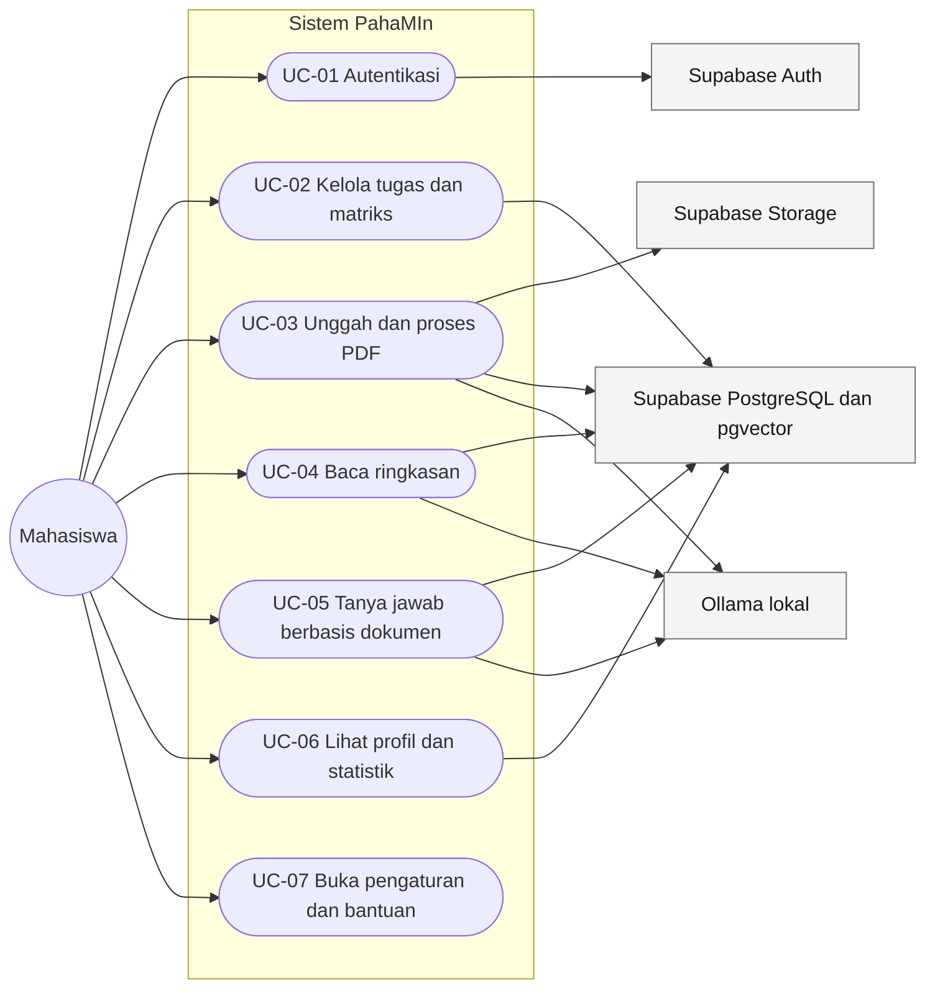
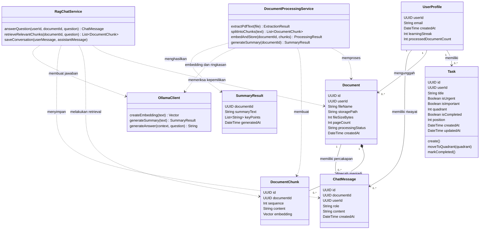

# Spesifikasi Kebutuhan Perangkat Lunak PahaMIn

| Informasi | Nilai |
|---|---|
| Nama sistem | PahaMIn |
| Tim | INTERCORP |
| Jenis dokumen | SKPL / Software Requirements Specification |
| Versi | 1.0 |
| Status | Rancangan untuk review tim |
| Tanggal | 1 Oktober 2026 |
| Acuan kebutuhan utama | [`project-requirements.md`](project-requirements.md) |

Dokumen ini memformalkan kebutuhan perangkat lunak, diagram use case, skenario, dan model kelas PahaMIn untuk keperluan pengembangan serta review akademik. PRD tetap menjadi sumber utama scope produk. Jika ada perbedaan, keputusan terbaru yang disetujui pada PRD mengungguli dokumen ini.

## 1. Pendahuluan

### 1.1 Tujuan

SKPL ini menjadi acuan bagi pengembang, QA, dan reviewer dalam memahami kemampuan yang perlu disediakan PahaMIn, batas sistem, interaksi eksternal, serta data konseptualnya.

### 1.2 Lingkup

PahaMIn adalah aplikasi web untuk membantu mahasiswa mengelola prioritas tugas menggunakan Matriks Eisenhower dan memahami materi melalui Ruang Paham. Ruang Paham memproses PDF dan menyediakan ringkasan serta tanya jawab berbasis Retrieval-Augmented Generation (RAG).

UI/UX sudah tersedia di Figma. Implementasi web harus mengikuti desain tersebut dan ekspor layar yang diberikan tim; dokumen ini tidak meminta pembuatan ulang UI.

### 1.3 Istilah

| Istilah | Arti |
|---|---|
| SKPL / SRS | Spesifikasi Kebutuhan Perangkat Lunak |
| Matriks Eisenhower | Pengelompokan tugas menurut urgensi dan kepentingan ke empat kuadran |
| RAG | Retrieval-Augmented Generation; pembuatan jawaban dengan mengambil konteks relevan dari dokumen |
| Chunk | Potongan teks dokumen yang diindeks dan digunakan untuk retrieval |
| RLS | Row Level Security, kebijakan database untuk membatasi akses baris berdasarkan pengguna |
| Ollama | Runtime model lokal untuk embedding dan generasi jawaban |

## 2. Deskripsi Umum

### 2.1 Pengguna dan Aktor

- **Mahasiswa:** aktor utama yang mengelola tugas, PDF, percakapan, dan profil miliknya.
- **Supabase Auth:** sistem eksternal yang memvalidasi sesi dan identitas pengguna.
- **Supabase PostgreSQL, pgvector, dan Storage:** layanan eksternal untuk menyimpan data, embedding, dan file sesuai kepemilikan.
- **Ollama lokal:** layanan model untuk embedding, ringkasan, dan jawaban chat.
- **Administrator teknis:** anggota tim pengembang yang mengelola infrastruktur melalui dashboard Supabase dan lingkungan pengembangan. Tidak ada antarmuka administrator di dalam produk.

### 2.2 Lingkungan dan Arsitektur

- **Frontend:** Next.js, React, TypeScript, Tailwind CSS v4, shadcn/ui, dan Supabase SSR.
- **Backend AI:** FastAPI, Python, Pydantic, dan PyMuPDF.
- **Data, autentikasi, dan penyimpanan:** Supabase PostgreSQL, Supabase Auth, Supabase Storage, RLS, dan pgvector.
- **AI lokal:** Ollama `qwen 3.6` untuk chat/ringkasan dan `nomic-embed-text` untuk embedding.
- CRUD umum tugas dan profil dilakukan melalui frontend ke Supabase. Ekstraksi PDF serta pemrosesan AI harus melewati FastAPI.

Google Gemini dan generator kuis tidak termasuk arsitektur maupun scope produk saat ini. Fitur kuis telah dihapus dari scope.

### 2.3 Batasan

1. Dokumen yang diterima hanya PDF, maksimal 5 MB per berkas.
2. Sistem memproses maksimal 20 halaman pertama.
3. Chunking menargetkan sekitar 500 token dengan overlap sekitar 50 token.
4. Retrieval menggunakan maksimal lima chunk relevan dari dokumen yang dipilih.
5. Sistem tidak mendukung mode offline.
6. Perilaku penghapusan, retensi dokumen, batas unggahan per akun, dan penyimpanan ringkasan masih perlu diputuskan.

## 3. Kebutuhan Fungsional

| ID | Prioritas | Kebutuhan |
|---|---|---|
| SKPL-F01 | Must | Pengguna dapat masuk dan keluar melalui metode autentikasi yang dipilih tim. Detail pendaftaran, verifikasi, dan pemulihan akun masih terbuka. |
| SKPL-F02 | Must | Pengguna dapat membuat dan melihat tugas dengan judul, urgensi, serta kepentingan; sistem menentukan kuadran awal berdasarkan dua atribut tersebut. |
| SKPL-F03 | Must | Pengguna dapat menandai tugas selesai dan memindahkan tugas antarkuadran. Perubahan disimpan; kegagalan simpan mengembalikan tampilan ke posisi sebelumnya dan menampilkan pesan. Pada layar kecil harus tersedia cara pemindahan yang tidak bergantung pada drag-and-drop. |
| SKPL-F04 | Open | Pengeditan/penghapusan tugas, tenggat, klasifikasi manual, dan hubungan atribut urgensi/kepentingan setelah pemindahan harus disetujui sebelum dibangun. |
| SKPL-F05 | Must | Pengguna dapat mengunggah PDF maksimal 5 MB. Sistem memvalidasi isi/format di backend, bukan hanya mempercayai nama file atau validasi browser. |
| SKPL-F06 | Must | Backend mengekstrak maksimal 20 halaman pertama menggunakan PyMuPDF dan memberi status proses yang dapat dipahami pengguna. PDF rusak, terenkripsi, kosong, atau tanpa teks yang dapat diekstrak ditangani sebagai kegagalan terkontrol. |
| SKPL-F07 | Must | Sistem memecah teks menjadi chunk sekitar 500 token dengan overlap sekitar 50 token, membuat embedding `nomic-embed-text`, dan menyimpan chunk/vektor dengan relasi ke dokumen pemilik. |
| SKPL-F08 | Must | Pengguna dapat meminta ringkasan materi. Ringkasan dibuat melalui FastAPI dan Ollama; bentuk, panjang, serta apakah ringkasan disimpan permanen masih terbuka. |
| SKPL-F09 | Must | Pengguna dapat mengajukan pertanyaan pada dokumen miliknya. Sistem melakukan retrieval maksimal lima chunk yang relevan dari dokumen tersebut dan menghasilkan jawaban dengan Ollama `qwen 3.6` berdasarkan konteks yang diambil. |
| SKPL-F10 | Must | Jika konteks yang ditemukan tidak cukup, sistem menyatakan keterbatasan dan tidak mengarang jawaban. Riwayat pertanyaan dan jawaban disimpan terkait pengguna serta dokumen yang benar. |
| SKPL-F11 | Must | Pengguna dapat melihat statistik profil yang berasal dari data miliknya. Definisi streak, zona waktu, dan hitungan dokumen perlu diputuskan sebelum implementasi statistik terkait. |
| SKPL-F12 | Must | Halaman pengaturan dan bantuan mengikuti layar Figma yang tersedia. Perilaku tema, ukuran teks, bahasa, notifikasi, FAQ, laporan bug, dan feedback masih perlu ditetapkan. |
| SKPL-F13 | Must | Sistem menyediakan status loading, sukses, kosong, dan error untuk alur utama tanpa menyimpang dari pola visual Figma. |

## 4. Kebutuhan Nonfungsional

| ID | Jenis | Kebutuhan |
|---|---|---|
| SKPL-NF01 | Keamanan | RLS aktif untuk seluruh data pengguna dan membatasi akses menggunakan identitas pemilik. FastAPI memvalidasi autentikasi serta kepemilikan dokumen pada setiap operasi AI. |
| SKPL-NF02 | Kerahasiaan | `SUPABASE_SERVICE_ROLE_KEY`, konfigurasi Ollama, dan rahasia lain hanya digunakan di server dan tidak dikirim ke browser atau prompt AI pihak luar. |
| SKPL-NF03 | Validasi | Input frontend divalidasi menggunakan Zod dan react-hook-form. Semua request FastAPI divalidasi dengan Pydantic. Validasi browser bukan batas keamanan. |
| SKPL-NF04 | Performa | Target respons AI kurang dari 10 detik. Lingkungan, kondisi cold start, dan cara mengukur target harus disepakati sebelum hasil dianggap terverifikasi. |
| SKPL-NF05 | Usability dan aksesibilitas | Layar mengikuti Figma, dapat digunakan dengan keyboard, menampilkan fokus yang jelas, serta tidak mengandalkan warna atau drag-and-drop sebagai satu-satunya cara memahami status/berinteraksi. |
| SKPL-NF06 | Responsivitas | UI menyesuaikan layar desktop dan kecil. Pada lebar di bawah 768 px, matriks disusun vertikal dan pemindahan tugas mendukung sentuhan; detail breakpoint lainnya mengikuti review Figma. |
| SKPL-NF07 | Keandalan | Kegagalan jaringan, database, storage, autentikasi, atau Ollama disampaikan tanpa membocorkan detail internal. Perubahan optimistik yang gagal disimpan harus dipulihkan. |
| SKPL-NF08 | Privasi | PDF dan isi dokumen diperlakukan sebagai data pengguna. Instruksi di dalam dokumen tidak boleh mengganti instruksi sistem AI atau membuka data di luar dokumen yang diizinkan. |

## 5. Use Case Diagram

Diagram berikut menunjukkan aktor dan use case yang termasuk scope terkini. Detail transport API, route, dan otorisasi antar layanan ditetapkan kemudian dalam rancangan teknis.

UC-07 mencakup layar yang tersedia pada desain. Perilaku fungsional tiap pengaturan/bantuan tetap mengikuti keputusan terbuka di PRD.

## 6. Skenario Use Case

### UC-01 — Autentikasi

| Bagian | Rincian |
|---|---|
| Aktor utama | Mahasiswa |
| Aktor pendukung | Supabase Auth |
| Tujuan | Memulai atau mengakhiri sesi pengguna. |
| Prasyarat | Aplikasi tersedia. Untuk login, pengguna sudah memiliki akun. |
| Pemicu | Pengguna memilih Masuk, Daftar, atau Keluar pada UI. |
| Alur utama | 1. Pengguna mengisi kredensial pada layar Figma. 2. Frontend mengirim kredensial ke Supabase Auth. 3. Supabase memvalidasi permintaan. 4. Frontend menerima status autentikasi dan sesi. 5. Pengguna diarahkan ke halaman yang sesuai. |
| Alur alternatif | Kredensial tidak valid atau layanan gagal; sistem menampilkan pesan aman dan mempertahankan kesempatan mencoba kembali. |
| Kondisi akhir | Sesi valid tersedia atau sesi pengguna telah diakhiri. |
| Catatan terbuka | Metode login, verifikasi email, reset kata sandi, dan provider pihak ketiga belum diputuskan. |

### UC-02 — Kelola Tugas pada Matriks Eisenhower

| Bagian | Rincian |
|---|---|
| Aktor utama | Mahasiswa |
| Aktor pendukung | Supabase PostgreSQL |
| Tujuan | Mengatur prioritas dan status tugas milik pengguna. |
| Prasyarat | Sesi valid dan pengguna membuka Matriks Tugas. |
| Pemicu | Pengguna membuat tugas, memindahkan tugas, atau menandainya selesai. |
| Alur utama | 1. Sistem mengambil dan menampilkan tugas pengguna. 2. Pengguna mengisi judul, urgensi, dan kepentingan untuk tugas baru. 3. Sistem menentukan kuadran awal: mendesak-penting, tidak mendesak-penting, mendesak-tidak penting, atau tidak mendesak-tidak penting. 4. Pengguna dapat memindahkan kartu ke kuadran lain atau menandainya selesai. 5. UI memperbarui tampilan secara optimistik dan mengirim perubahan ke Supabase. 6. Sistem mempertahankan perubahan setelah penyimpanan berhasil. |
| Alur alternatif | Jika penyimpanan gagal, UI mengembalikan kartu/status ke nilai sebelumnya dan menampilkan notifikasi error. Pada layar kecil, pengguna memindahkan tugas melalui kontrol sentuh yang tersedia. |
| Kondisi akhir | Perubahan tersimpan dan hanya dapat diakses oleh pemilik tugas. |
| Catatan terbuka | Pengeditan/penghapusan, tenggat, serta dampak pemindahan kuadran terhadap atribut urgensi dan kepentingan belum disetujui. |

### UC-03 — Unggah dan Proses PDF

| Bagian | Rincian |
|---|---|
| Aktor utama | Mahasiswa |
| Aktor pendukung | Supabase Storage, Supabase PostgreSQL/pgvector, FastAPI, Ollama |
| Tujuan | Mengubah PDF milik pengguna menjadi sumber belajar yang dapat diringkas dan ditanyakan. |
| Prasyarat | Sesi valid; pengguna memilih file PDF. |
| Pemicu | Pengguna mengunggah file. |
| Alur utama | 1. Frontend memberi umpan balik bahwa unggahan dimulai. 2. Sistem memvalidasi file di sisi server: format PDF dan ukuran maksimal 5 MB. 3. File disimpan dengan akses yang dibatasi kepada pemilik. 4. FastAPI memeriksa otorisasi serta mengekstrak maksimal 20 halaman pertama memakai PyMuPDF. 5. Teks dipecah menjadi chunk sekitar 500 token dengan overlap sekitar 50 token. 6. Ollama membuat embedding `nomic-embed-text`. 7. Sistem menyimpan metadata dokumen, chunk, dan vector yang terhubung ke pemilik. 8. UI menunjukkan status berhasil diproses. |
| Alur alternatif | File bukan PDF, terlalu besar, rusak, terenkripsi, kosong, atau tidak memiliki teks yang dapat diekstrak; sistem menolak atau menandai proses gagal dan menampilkan pesan yang dapat dipahami. Gangguan Storage, database, atau Ollama tidak boleh meninggalkan status sukses palsu. |
| Kondisi akhir | Dokumen berhasil diproses dan siap digunakan, atau pengguna menerima status gagal yang jelas. |
| Catatan terbuka | Rute API, mekanisme transfer aman ke FastAPI, jumlah unggahan, pemrosesan ulang, serta retensi/penghapusan harus ditetapkan dalam rancangan teknis/keputusan produk. |

### UC-04 — Baca Ringkasan Materi

| Bagian | Rincian |
|---|---|
| Aktor utama | Mahasiswa |
| Aktor pendukung | FastAPI, Ollama, Supabase |
| Tujuan | Membaca ringkasan dari dokumen yang sudah diproses. |
| Prasyarat | Sesi valid; dokumen milik pengguna berhasil diproses. |
| Pemicu | Pengguna membuka ringkasan atau meminta ringkasan dibuat. |
| Alur utama | 1. Sistem memeriksa kepemilikan dokumen. 2. FastAPI menyiapkan teks dokumen yang telah diekstrak. 3. Ollama `qwen 3.6` menghasilkan ringkasan sesuai schema respons. 4. FastAPI memvalidasi respons dan mengembalikannya ke frontend. 5. UI menampilkan ringkasan dan statusnya. |
| Alur alternatif | Dokumen tidak dimiliki pengguna, belum selesai diproses, atau Ollama gagal; sistem menolak akses atau menampilkan status yang dapat dipulihkan. |
| Kondisi akhir | Ringkasan ditampilkan atau pengguna menerima informasi kegagalan. |
| Catatan terbuka | Panjang/format ringkasan serta apakah hasil disimpan permanen belum diputuskan. `SummaryResult` pada class diagram adalah hasil layanan konseptual, bukan tabel database yang sudah disetujui. |

### UC-05 — Tanya Jawab Berbasis Dokumen

| Bagian | Rincian |
|---|---|
| Aktor utama | Mahasiswa |
| Aktor pendukung | FastAPI, Supabase pgvector/PostgreSQL, Ollama |
| Tujuan | Mendapat jawaban berdasarkan dokumen milik pengguna. |
| Prasyarat | Sesi valid; dokumen pengguna telah diproses. |
| Pemicu | Pengguna mengirim pertanyaan pada dokumen yang dipilih. |
| Alur utama | 1. FastAPI memvalidasi pengguna dan kepemilikan dokumen. 2. Sistem membuat embedding pertanyaan. 3. Supabase pgvector mencari paling banyak lima chunk relevan hanya dalam cakupan dokumen yang dipilih. 4. Ollama `qwen 3.6` membuat jawaban berdasarkan chunk tersebut. 5. FastAPI memvalidasi format respons. 6. Pesan pengguna dan jawaban disimpan terkait dokumen serta pemilik. 7. Frontend menampilkan jawaban dan riwayat percakapan. |
| Alur alternatif | Pertanyaan kosong ditolak melalui validasi. Jika tidak ada konteks yang cukup, sistem menyatakan keterbatasan dan tidak mengarang jawaban. Jika layanan gagal, UI menampilkan error dan memungkinkan percobaan kembali. |
| Kondisi akhir | Percakapan tampil dan tercatat, atau pengguna menerima status kegagalan. |
| Catatan terbuka | Format citation/sumber jawaban dan batas performa terukur harus disepakati sebelum klaim produk final. |

### UC-06 — Lihat Profil dan Statistik

| Bagian | Rincian |
|---|---|
| Aktor utama | Mahasiswa |
| Aktor pendukung | Supabase PostgreSQL |
| Tujuan | Melihat ringkasan aktivitas belajar milik sendiri. |
| Prasyarat | Sesi valid. |
| Pemicu | Pengguna membuka halaman profil. |
| Alur utama | 1. Sistem mengambil statistik yang disetujui dari data pengguna. 2. Sistem menampilkan aktivitas belajar, dokumen, percakapan, dan streak sesuai UI Figma. |
| Alur alternatif | Data belum tersedia, terjadi error, atau sesi tidak valid; sistem menampilkan keadaan kosong, error, atau mengarahkan ke autentikasi. |
| Kondisi akhir | Statistik yang ditampilkan hanya berasal dari data pemilik akun. |
| Catatan terbuka | Rumus streak, zona waktu, dan definisi jumlah dokumen harus disepakati. |

## 7. Class Diagram

Diagram ini menggambarkan model konseptual yang ada pada PRD. Tabel database, kolom final, indeks, dan kebijakan relasi tetap harus disahkan melalui rancangan skema/migrasi.

### 7.1 Penjelasan Model

- **UserProfile** merepresentasikan profil aplikasi yang terhubung ke identitas Supabase Auth. Detail statistik dan streak tetap mengikuti keputusan terbuka pada PRD.
- **Task** menyimpan urgensi, kepentingan, kuadran, posisi, dan status selesai. Tenggat, pengeditan, dan penghapusan belum dimasukkan sebagai perilaku pasti karena masih terbuka.
- **Document** menyimpan metadata file dan status proses; isi file disimpan terpisah di Storage.
- **DocumentChunk** menghubungkan teks dan embedding dengan dokumen. Kepemilikan chunk diturunkan dari dokumen yang dimiliki pengguna.
- **ChatMessage** mencatat pesan user/asisten yang terkait dokumen dan pemiliknya.
- **SummaryResult** adalah hasil layanan konseptual. Diagram tidak menyatakan bahwa sudah ada tabel ringkasan terpisah.
- **DocumentProcessingService**, **RagChatService**, dan **OllamaClient** adalah layanan konseptual untuk menjelaskan tanggung jawab arsitektur, bukan class atau endpoint yang telah diimplementasikan.
- Tidak ada class `Quiz`, `Question`, atau `QuizAttempt`, karena kuis bukan bagian scope PahaMIn saat ini.

## 8. Traceability dan Keputusan Terbuka

Kebutuhan pada dokumen ini memetakan bagian fungsional PRD: `FR-AUTH`, `FR-TASK`, `FR-RAG`, `FR-PROFILE`, dan `FR-SET`. Detail prioritas, kriteria penerimaan, keamanan, dan keputusan terbuka tetap ada di [`project-requirements.md`](project-requirements.md).

Sebelum schema dan interaksi terkait difinalkan, tim perlu memutuskan metode autentikasi, pengeditan/penghapusan tugas, arti pemindahan kuadran terhadap urgensi/kepentingan, format dan persistensi ringkasan, citation jawaban, retensi dokumen, rumus streak, dan perilaku pengaturan. Jangan memperlakukan item **Open** sebagai kebutuhan final sebelum review.

## 9. Referensi Proyek

- [PRD dan kriteria penerimaan](project-requirements.md)
- [Konteks proyek](CONTEKST_PROYEK3.md)
- [Design brief](design-brief.md)
- [Panduan UI/UX Figma](panduan/UI_DESIGN_REFERENCE.md)
- [Ekspor layar Figma](design-reference/figma-exports/)
- [Aturan coding dan arsitektur](panduan/.cursorrules)
